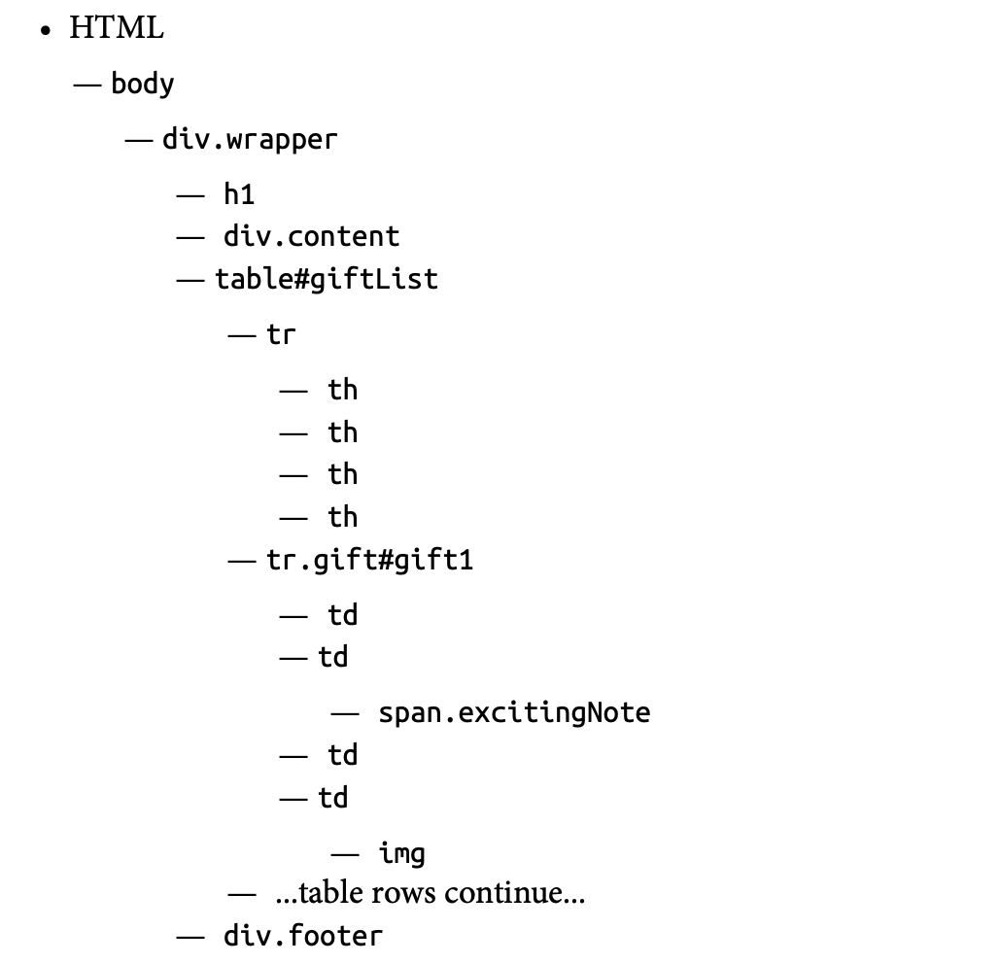

## HTML的剖析

```python
bs.find_all('table')[4].find_all('tr')[2].find('td').find_all('div')[1].find('a')
```

當要擷取的資料，是位於比較深層的標籤，盡量不要使用上面的語法，這樣的方式，只要網頁內容稍有改變，這個擷取的語法可能會失敗。

在擷取標籤內容時，要考慮所在的位置，整體的內容，元素的屬性，元素的內容

### BeautifulSout的其它工具

- 學習如何透過屬性取得資料
- 學習如何從元素串列中取得資料
- 學習如何解析元素樹

```html
<span class="green"></span>

<span class="red"></span>
```

可以透過元素屬性class="xxx"或id="xxx"取得所有符合的標籤

> 範列來源
>
```
http://www.pythonscraping.com/pages/warandpeace.html
```

透過網頁開發工具(chrome 開發人員工具)，可以搜尋到class="red"有45個標籤,class="green"有42個標籤。如下

```html
<span class="red">Heavens! what a virulent attack!</span> replied 
<span class="green">the prince</span>,
not in the least disconcerted by this reception.
```

## 學習如何透過屬性取得資料,元素串列中取得資料

#### 先取得所有頁面內容，並建立BeautifulSoup物件 

```python
from urllib.request import urlopen
from bs4 import BeautifulSoup

html = urlopen('http://www.pythonscraping.com/pages/warandpeace.html')
bs = BeautifulSoup(html.read(), 'html.parser')
print(type(bs))

結果:=======================
<class 'bs4.BeautifulSoup'>
```

建立BeautifulSoup實體

#### 使用 find_all function

```python
nameList = bs.findAll('span', {'class':'green'})
for name in nameList:
    print(type(name))
    print(name.get_text())
    
結果:=======================
<class 'bs4.element.Tag'>
Anna
Pavlovna Scherer
<class 'bs4.element.Tag'>
Empress Marya
Fedorovna
<class 'bs4.element.Tag'>
Prince Vasili Kuragin
<class 'bs4.element.Tag'>
Anna Pavlovna
<class 'bs4.element.Tag'>
St. Petersburg
<class 'bs4.element.Tag'>
the prince
...
```

使用BeautifulSoup實體findAll(標籤名稱, 標籤屬性)方法，取得list物件。list內是Tag實體，再使用Tag實體的get_text()方法取得元素內容。

#### find() and find_all()

官方文件說明find(),find_all(),2個的功能幾乎一樣

```
find_all(tag, attributes, recursive, text, limit, keywords)
find(tag, attributes, recursive, text, keywords)
```

#### find_all()取得多個標籤

```python
.find_all(['h1','h2','h3','h4','h5','h6'])
```

#### find_all()取得多屬性內容

```python
.find_all('span', {'class':{'green', 'red'}})
```

#### 引數 recursive

recursive引數預設是False，就是只搜尋最上層的標籤，不搜尋標籤內容的內容. 

#### 引數 text
搜尋元素內容有包含text內容的標籤

```
nameList = bs.find_all(text='the prince')
print(len(nameList))

結果:==========================
7
```

#### 引數 limit 限定取出的數量

預設為沒有限定

#### 引數 keyword

```python
title = bs.find(id='title')
```

取出有屬性id="title"的元素

範例:  

```python
title = bs.find(id='text')
print(title.getText())

結果:===================
"Well, Prince, so Genoa and Lucca are now just family estates of the
Buonapartes. But I warn you, if you don't tell me that this means war,
if you still try to defend the infamies and horrors perpetrated by
that Antichrist- I really believe he is Antichrist- I will have
nothing more to do with you and you are no longer my friend, no longer
my 'faithful slave,' as you call yourself! But how do you do? I see
I have frightened you- sit down and tell me all the news."

It was in July, 1805, and the speaker was the well-known Anna
Pavlovna Scherer, maid of honor and favorite of the Empress Marya
Fedorovna. With these words she greeted Prince Vasili Kuragin, a man
of high rank and importance, who was the first to arrive at her
reception. Anna Pavlovna had had a cough for some days. She was, as
she said, suffering from la grippe; grippe being then a new word in
St. Petersburg, used only by the elite.

All her invitations without exception, written in French, and
delivered by a scarlet-liveried footman that morning, ran as follows:

"If you have nothing better to do, Count [or Prince], and if the
prospect of spending an evening with a poor invalid is not too
terrible, I shall be very charmed to see you tonight between 7 and 10-
Annette Scherer."
```

get_text()，取出的內容如果有標籤，會全部移除

下方是相同的功能:

```python
bs.find_all(id='text')
bs.find_all('', {'id':'text'})
```

#### 下方是相同的功能:

```
bs.find_all(class='green') #會出錯

bs.find_all(class_='green')
bs.find_all('', {'class':'green'})
```

#### 取出有多個屬性的元素

```python
title = bs.find_all(id='title', class_='text')
```

## 解析元素樹

find_all function 功能可以利用標籤名和屬性擷取資料。但是如果要利用樹狀結構取得資料，可以利用連續串接的手法。

```
bs.tag.subTag.anotherSubTag
```

##### 範例網頁
```
http://www.pythonscraping.com/pages/page3.html
```


##### html架構



#### 操控子元素和子孫元素

子元素，代表是父元素的下一個元素，子孫元素代表的是父元素下的所有元素。一般BeautifulSoup function是使用子孫元素，bs.body.h1 所代表的意思尋找body內的第一個h1元素。

相同的，bs.div.find_all('img') 將尋找div內第一個img元素。

如果只想要直接子元素，請使用 .children屬性

```python
from urllib.request import urlopen
from bs4 import BeautifulSoup

html = urlopen('http://www.pythonscraping.com/pages/page3.html')
bs = BeautifulSoup(html, 'html.parser')

for child in bs.find('table',{'id':'giftList'}).children:
    print(child)
    
結果:=====================================
<tr><th>
Item Title
</th><th>
Description
</th><th>
Cost
</th><th>
Image
</th></tr>


<tr class="gift" id="gift1"><td>
Vegetable Basket
</td><td>
This vegetable basket is the perfect gift for your health conscious (or overweight) friends!
<span class="excitingNote">Now with super-colorful bell peppers!</span>
</td><td>
$15.00
</td><td>

</td></tr>

.
.
.
```

如果使用 .descendants屬性,會依序尋找所有子元素

```python
from urllib.request import urlopen
from bs4 import BeautifulSoup

html = urlopen('http://www.pythonscraping.com/pages/page3.html')
bs = BeautifulSoup(html, 'html.parser')

for child in bs.find('table',{'id':'giftList'}).descendants:
    print(child)
    
結果:===========================
<tr><th>
Item Title
</th><th>
Description
</th><th>
Cost
</th><th>
Image
</th></tr>
<th>
Item Title
</th>

Item Title

<th>
Description
</th>

Description

<th>
Cost
</th>

Cost

<th>
Image
</th>

```

#### 操控同一階層元素

使用BeautifulSoup next_siblings() function

```python
from urllib.request import urlopen
from bs4 import BeautifulSoup

html = urlopen('http://www.pythonscraping.com/pages/page3.html')
bs = BeautifulSoup(html, 'html.parser')

for child in bs.find('table',{'id':'giftList'}).tr.next_siblings: #先找到table內第一個tr,並找尋所有後面相同階層的元素
    print(child)

結果:===========================
<tr class="gift" id="gift1"><td>
Vegetable Basket
</td><td>
This vegetable basket is the perfect gift for your health conscious (or overweight) friends!
<span class="excitingNote">Now with super-colorful bell peppers!</span>
</td><td>
$15.00
</td><td>

</td></tr>


<tr class="gift" id="gift2"><td>
Russian Nesting Dolls
</td><td>
Hand-painted by trained monkeys, these exquisite dolls are priceless! And by "priceless," we mean "extremely expensive"! <span class="excitingNote">8 entire dolls per set! Octuple the presents!</span>
</td><td>
$10,000.52
</td><td>

</td></tr>

.
.
.
```

相似尋找多個的功能有:
- next_siblings,previous_siblings

相似尋找一個的功能有:
- next_sibling,previous_sibling

#### 操控父元素

使用 .parent 或 .parents

```python
from urllib.request import urlopen
from bs4 import BeautifulSoup

html = urlopen('http://www.pythonscraping.com/pages/page3.html')
bs = BeautifulSoup(html, 'html.parser')

print(bs.find('img',{'src':'../img/gifts/img1.jpg'}).parent.previous_sibling.get_text())
    
```

### 正規則運算式
