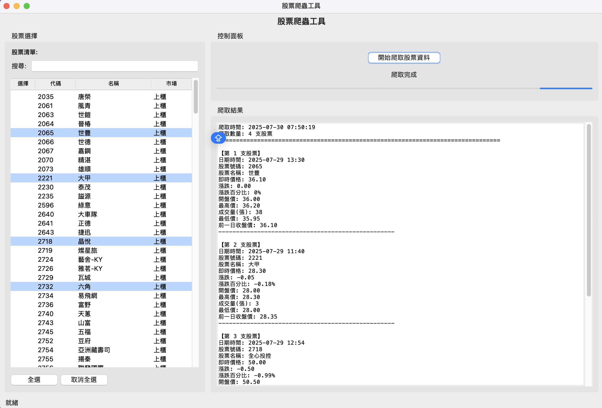
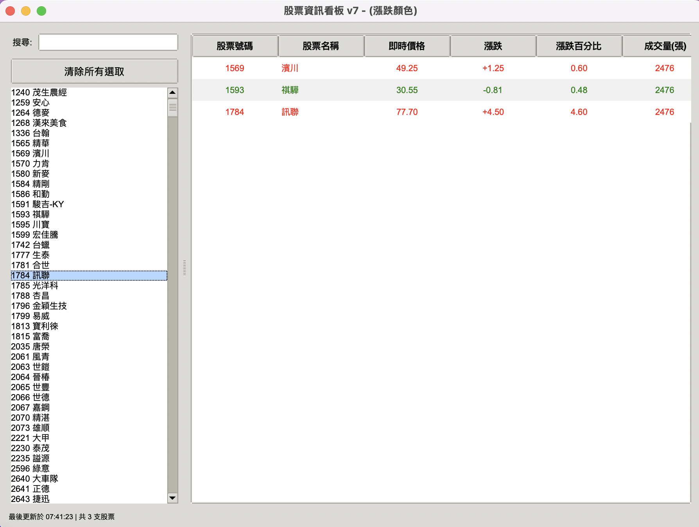

# 使用crawl4AI必需了解python asyncio套件

### [有關於asyncio套件說明](./asyncio套件教學)

# Crawl4AI
Crawl4AI 是一套專為人工智慧（AI）和大型語言模型（LLM）應用設計的開源 Python 網頁爬蟲與資料擷取工具。它具備高效能的非同步和平行處理能力，能快速抓取大量網頁，並支援動態網站的無頭瀏覽器操作（如 Playwright 的 Chromium），能執行 JavaScript 以獲取動態內容。

### [安裝Crawl4A](./安裝)

## [Crawl4A初體驗](./初體驗)

## [Crawl4A快速入門](./Crawl4A快速入門)

## [不需要LLM的提取網頁內容方式](./Crawl4A快速入門/手動方式產生css_schema)

## [操控javascript的動態提取](./Crawl4A操控javascript)

## [多網址爬蟲](./Crawl4A多頁面爬蟲)

## [排程](./排程)

## [docker](./docker)

## 實際案例:
**單頁面爬蟲**

[**台灣銀行牌告匯率_靜態爬蟲**](./實際案例/1台灣銀行牌告匯率/main.py)

[**台灣即時股票資訊_動態爬串**](./實際案例/2台灣即時股票資訊_動態爬串/main.py)

---

**多頁面爬蟲**

- **基本方法**（較慢）：用 for 迴圈一個一個爬
  - [範例程式1](./Crawl4A多頁面爬蟲/lesson1_爬取台灣即時股票資訊_loop方式.py)
- **進階方法**（推薦）：用 arun_many() 一次處理多個網址
  - [範例程式2](./lesson2_爬取台灣即時股票資訊_async方式.py)

---

### 兩種方法的優缺點比較

| 方法         | 優點                                   | 缺點                                      |
|--------------|----------------------------------------|-------------------------------------------|
| 基本方法     | 觀念簡單、容易理解，適合初學者入門      | 速度慢、無法同時處理大量網址，效率較低      |
| 進階方法     | 可以同時爬很多網址，速度快，自動管理資源 | 程式碼稍複雜，但 arun_many() 已幫你包好    |

### 建議
- 如果你只是要爬幾個網址、想先練習基本觀念，可以用『基本方法』。
- 如果你要爬很多網址、追求效率，建議直接用『進階方法』（arun_many()），省時又安全。

---

**整合tkinter**

[台灣即時股票資訊_tkinter](./實際案例/4台灣即時股票資訊_tkinter)

- 無自動更新功能
- 主執行檔:index.py

**資源-股票代號查詢:**

```bash
pip install twstock
```



[台灣即時股票資訊_tkinter](./實際案例/3台灣即時股票資訊_tkinter)

- 包含自動更新功能
- 主執行檔main.py

**資源-股票代號查詢:**

```bash
pip install twstock
```


